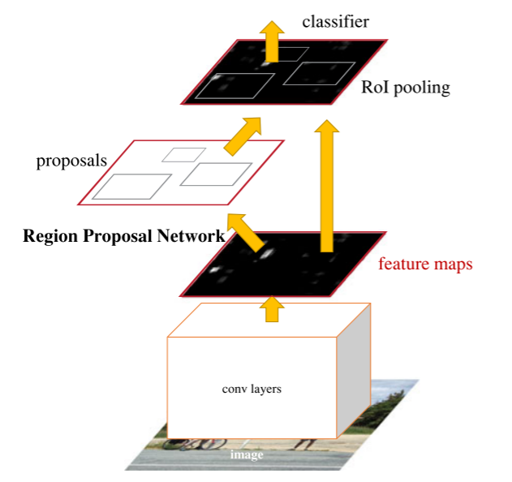

# Faster-RCNN-pytorch
implement Faster-RCNN by Pytorch
This code Learned from [https://github.com/chenyuntc/simple-faster-rcnn-pytorch.git]()，And I personally made relevant optimizations, such as adding a video target detection algorithm.

If you need the pretrained model of Vgg16_caffe.pth or resnet101_caffe.pth, you can send an email to me.

The method of Faster R-CNN is as follows
