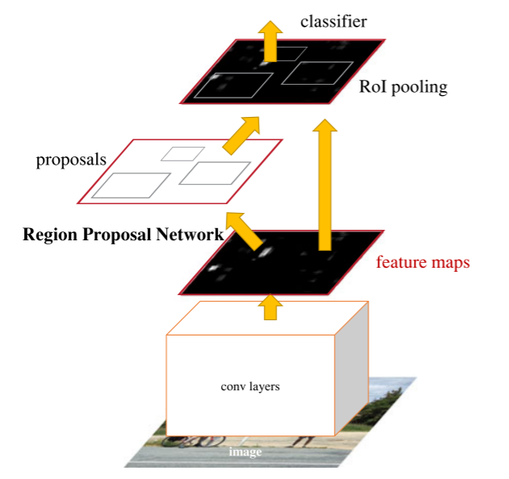
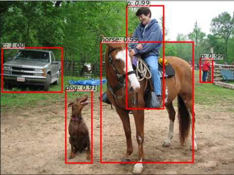

# Faster R-CNN-pytorch
Pytorch implementation of the faster R-CNN.And I personally made relevant optimizations, such as adding a video target detection algorithm.

<div align="center">
  
</div>

## :wave:Introduction

This is one of my assessment tasks. By reading the classic algorithm of target detection, I understood the working principle of Faster-RCNN, and reproduced the paper using pytorch, and added target detection in the video on this basis. Through this reproduction, I have a deeper understanding and knowledge of the problem of target detection.

## :fire:Run

Dataset: We mainly conducted related experiments on **VOC2007** and **VOC2012**, you can also choose other dataset to train the model.

1. Set up the environment, simply run:

   ```shell
   pip install -r requirements.txt
   ```

2. Train the model, simply run:

   ```shell
      python train.py\
              --env 'lanta10_fasterrcnn'\
              --pretrained_model 'vgg16' \
              --voc_data_dir ['Dataset/VOCdevkit2007/VOC2007/'] \
              --plot_every 100 \
              --caffe_pretrain True \
              --caffe_pretrain_path  'pretrained/vgg16_caffe.pth' \
              --gpu '0' \
              --lr 1e-3 \
              --lanta 1 \
              --use_adam False \
              --use_drop False \
   ```

3. evaluate the model, simply run:

   ```shell
    python test.py\
              --env 'lanta10_fasterrcnn'\
              --pretrained_model 'vgg16' \
              --voc_data_dir ['Dataset/VOCdevkit2007/VOC2007/'] \
              --plot_every 100 \
              --caffe_pretrain True \
              --caffe_pretrain_path  'pretrained/vgg16_caffe.pth' \
              --gpu '0' \
              --lr 1e-3 \
              --lanta 1 \
              --use_adam False \
              --use_drop False \
   ```

   If you want to evaluate other Pre-training weight, you just modify **line 75 of test.py**:

   ```python
   trainer.load('save/fasterrcnn_09071339_0.6984935332483329')
   ```

4. Infer in the image, simply run the demo.ipynb, and the example is as follow:

   <div align="center">
     
   </div>

5. Infer in the video, simply run the infer.py:

   ```shell
   python infer.py 
   ```

   If you want to evaluate other Pre-training weight or other video, you just modify **line 75 and line 61 and 63 of infer.py**:

   ```python
   trainer.load('save/fasterrcnn_09071339_0.6984935332483329')
   cap = cv2.VideoCapture("misc/playing_ball.mp4")
   ```

   And you can see in the example in the assets/test_in_video.mp4.

## :mag:Results

The result of my Faster R-CNN is as follows:

| Pretrained Model  | Map(%) | Paper Map(%) |
| ----------------- | ------ | ------------ |
| VGG16_torchvision | 68.76  | /            |
| VGG16_caffe       | 69.85  | 69.9         |

Discussion on training set size

| Dataset                    | Map(%) | Paper Map(%) |
| -------------------------- | ------ | ------------ |
| PASCAL VOC 2007            | 69.46  | 69.9         |
| PASCAL VOC 2007 + VOC 2012 | 76.37  | 73.2         |

## :heart: Acknowledgements

Our code is mainly modified on the [simple-faster-rcnn-pytorch](https://github.com/chenyuntc/simple-faster-rcnn-pytorch.git).

## :smirk: Tips

If you need the pretrained model of **Vgg16_caffe.pth** or **resnet101_caffe.pth**, please contact me at wucunqi2003@126.com.
